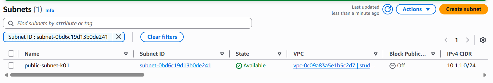
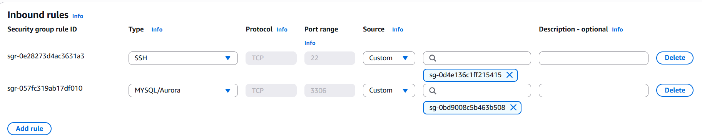

# Лабораторная работа №3. Облачные сети

## Цели работы

Научиться вручную создавать виртуальную сеть (VPC) в AWS, добавлять в неё подсети, таблицы маршрутов, интернет-шлюз (IGW) и NAT Gateway, а также настраивать взаимодействие между веб-сервером в публичной подсети и сервером базы данных в приватной.

После выполнения работы студент:

- понимает, как формируется изоляция сетей в AWS (VPC);
- умеет создавать и связывать компоненты сети;
- знает, как EC2-инстансы разных подсетей взаимодействуют друг с другом;
- различает публичные и приватные маршруты.

## Условия

**Amazon VPC (Virtual Private Cloud)** — это изолированная виртуальная сеть внутри AWS, в которой можно определять адресное пространство, создавать подсети, шлюзы и управлять доступом к ресурсам.

**Основные компоненты:**

- _Публичная подсеть_. Для веб-сервера (имеет выход в интернет).
- _Приватная подсеть_. Для базы данных (без прямого доступа извне).
- _NAT Gateway_. Чтобы приватные ресурсы имели доступ в интернет (например, для обновления ПО).
- _Route Tables_. Определяют, куда направлять трафик.
- _Security Groups_. Управляют входящими и исходящими соединениями на уровне инстансов.
- _EC2-инстансы_. Веб-сервер, сервер базы данных и bastion host.

## Постановка задачи

Создать изолированную облачную сеть с:

- публичной и приватной подсетями;
- интернет-шлюзом (IGW) и NAT Gateway;
- отдельными таблицами маршрутов;
- тремя EC2-инстансами: **Web Server**, **DB Server**, **Bastion Host**;
- тремя Security Groups с ограничениями доступа;
- проверкой связи между подсетями.

## Практическая часть

### Шаг 1. Подготовка среды


### Шаг 2. Создание VPC

- **Имя:** `student-vpc-k01`
- **CIDR блок:** `10.1.0.0/16`


**Ответ на вопрос:**  
Маска `/16` означает, что первые 16 бит — это часть сети, а оставшиеся 16 — для хостов (65 536 адресов).  
Маску `/8` использовать нельзя, потому что она создаёт слишком большое адресное пространство и нарушает изоляцию.

### Шаг 3. Создание Internet Gateway

- **Имя:** `student-igw-k01`
- IGW прикреплён к `student-vpc-k01`.


**Назначение:** обеспечивает выход в интернет для публичных инстансов.

### Шаг 4. Создание подсетей

#### Шаг 4.1 Создание публичной подсети

- **Имя:** `public-subnet-k01`
- **CIDR:** `10.1.1.0/24`
- **AZ:** `eu-central-1a`


**Ответ на вопрос:**  
Подсеть пока не публичная, так как маршруты ещё не настроены.

#### Шаг 4.2 Создание приватной подсети

- **Имя:** `private-subnet-k01`
- **CIDR:** `10.1.2.0/24`
- **AZ:** `eu-central-1b`
  

  **Ответ на вопрос:**
  На данный момент подсеть ещё не является приватной,
  поскольку у неё нет маршрута через NAT Gateway и нет отдельной таблицы маршрутов,
  которая бы ограничивала прямой выход в интернет.

### Шаг 5 Создание таблиц маршрутов (Route Tables)

#### Шаг 5.1 Создание публичной таблицы маршрутов

- **Имя:** `public-rt-k01`
- **Маршрут:** `0.0.0.0/0 → Internet Gateway (student-igw-k01)`
- **Ассоциация:** `public-subnet-k01`
  
  **Ответ на вопрос:**  
  Таблица маршрутов привязывается к подсети, чтобы указать, через какой шлюз должен идти внешний трафик.

#### Приватная таблица

- **Имя:** `private-rt-k01`
- **Ассоциация:** `private-subnet-k01`
  
  

### Шаг 6. Создание NAT Gateway


**Ответ на вопрос:**
NAT Gateway (Network Address Translation Gateway) работает как посредник между приватной подсетью и интернетом.

#### Шаг 6.1. Создание Elastic IP

**Elastic IP** — это статический публичный IPv4-адрес, закреплённый за вашим AWS-аккаунтом.  
Он используется NAT Gateway в качестве точки выхода в Интернет.

**Действия:**

1. В меню слева **Elastic IPs → Allocate Elastic IP address**.
2. **Allocate**.
3. Новый EIP появится в списке — запомнить его, он понадобится при создании NAT Gateway.  
   

### Шаг 6.2. Создание NAT Gateway

1. В меню слева **NAT Gateways → Create NAT Gateway**.
2. Указываем:
   - **Name tag:** `nat-gateway-k01`
   - **Subnet:** `public-subnet-k01` _(обязательно публичная, чтобы NAT имел доступ в Интернет через IGW)_
   - **Connectivity type:** `Public`
   - **Elastic IP allocation ID:** выбрал тот, что создали ранее.
3. Нажимаем **Create NAT gateway**.

Нужно подождать 2–3 минуты, пока статус изменится с **Pending** на **Available**.  
Это означает, что NAT Gateway готов к использованию.


### Шаг 6.3. Изменение приватной таблицы маршрутов

Теперь нужно направить интернет-трафик из приватной подсети через NAT Gateway.

**Действия:**

1. Переходим в **Route Tables**.
2. Выберите таблицу **private-rt-k01**.
3. На вкладке **Routes** нажимаем **Edit routes → Add route**.
4. Указываем:
   - **Destination:** `0.0.0.0/0`
   - **Target:** выбераем **nat-gateway-k01**.
5. Нажимаем **Save changes**.

После этого все ресурсы в приватной подсети смогут безопасно выходить в Интернет через NAT Gateway,  
не раскрывая свои приватные IP-адреса и оставаясь полностью изолированными от внешнего доступа.

### Шаг 7. Создание Security Groups

#### `web-sg-k01`

| Тип   | Протокол | Порт | Источник  |
| ----- | -------- | ---- | --------- |
| HTTP  | TCP      | 80   | 0.0.0.0/0 |
| HTTPS | TCP      | 443  | 0.0.0.0/0 |


#### `bastion-sg-k01`

| Тип | Протокол | Порт | Источник |
| --- | -------- | ---- | -------- |
| SSH | TCP      | 22   | Мой IP   |


#### `db-sg-k01`

| Тип          | Протокол | Порт | Источник       |
| ------------ | -------- | ---- | -------------- |
| MySQL/Aurora | TCP      | 3306 | web-sg-k01     |
| SSH          | TCP      | 22   | bastion-sg-k01 |



**Ответ:**  
Bastion Host — это промежуточный сервер, через который можно безопасно подключаться к приватным ресурсам (например, к базе данных).

---

### Шаг 8. Создание EC2-инстансов

#### Web Server

- **Имя:** `web-server`
- **Подсеть:** `public-subnet-k01`
- **Security Group:** `web-sg-k01`
- **Публичный IP:** `3.122.51.217`

**User Data:**

```bash
#!/bin/bash
dnf install -y httpd php
echo "<?php phpinfo(); ?>" > /var/www/html/index.php
systemctl enable httpd
systemctl start httpd
```

Проверка в браузере:
`http://3.122.51.217` → страница PHPInfo успешно открылась


#### db-server

- **Имя:** `db-server`
- **Подсеть:** `private-subnet-k01`
- **Security Group:** `db-sg-k01`
- **Приватный IP:** `10.1.2.108`

**User Data:**

```bash
#!/bin/bash
dnf install -y mariadb105-server
systemctl enable mariadb
systemctl start mariadb
mysql -e "ALTER USER 'root'@'localhost' IDENTIFIED BY 'StrongPassword123!'; FLUSH PRIVILEGES;"
```


#### Bastion Host

- **Имя:** `bastion-host`
- **Подсеть:** `public-subnet-k01`
- **Security Group:** `bastion-sg-k01`
- **Публичный IP:** `3.121.206.66`

**User Data:**

```bash
#!/bin/bash
dnf install -y mariadb105
```


## Шаг 9. Проверка работы

### 1. Подключение к Bastion Host

```bash
ssh -i student-key-bostion-k01.pem ec2-user@3.121.206.66

```


Успешно подключено

### 2. Проверка выхода в интернет

```bash
ping -c 4 google.com
```


Ответ получен — IGW работает.

---

### 3. Подключение с Bastion к DB Server

```bash
ssh -i student-key-db-k01.pem ec2-user@10.1.2.108
```


Подключение успешно
Проверка MariaDB:

```bash
sudo systemctl status mariadb
```


```
active (running)
```

### 4. Проверка доступа MySQL

С Bastion:

```bash
mysql -h 10.1.2.108 -u root -p
Enter password: StrongPassword123!
```

Ответ:

```
Welcome to the MariaDB monitor.
Server version: 10.5.29-MariaDB
```

Доступ к базе данных установлен.

## Вывод

В ходе лабораторной работы:

- создана и настроена VPC `student-vpc-k01`;
- реализованы публичная и приватная подсети;
- подключены IGW и NAT Gateway;
- настроены маршруты и группы безопасности;
- развернуты три EC2-инстанса (Web, DB, Bastion);
- обеспечено взаимодействие между ними через Bastion Host;
- подтверждена корректная работа сети.

Результат: все сервисы функционируют, подключение к базе данных через Bastion успешно.

**Список использованных источников:**

1. https://docs.aws.amazon.com/vpc/latest/userguide/what-is-amazon-vpc.html
2. https://docs.aws.amazon.com/vpc/latest/userguide/vpc-nat-gateway.html
3. https://docs.aws.amazon.com/AWSEC2/latest/UserGuide/elastic-ip-addresses-eip.html
