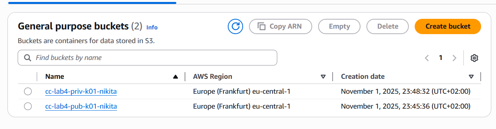
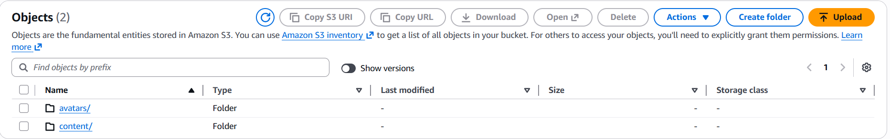
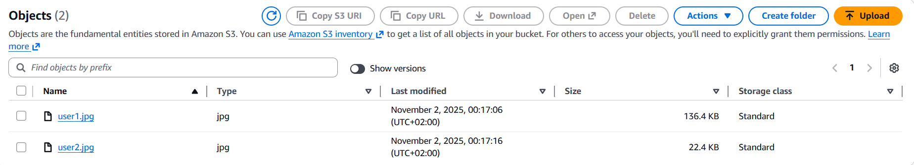
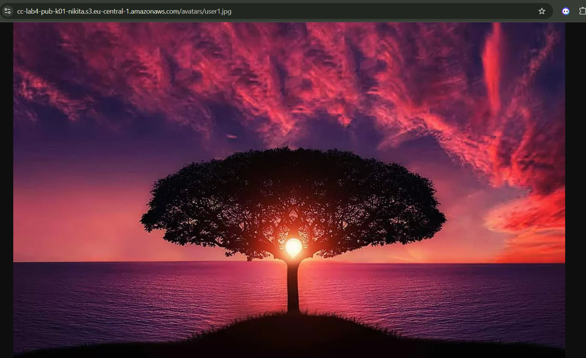
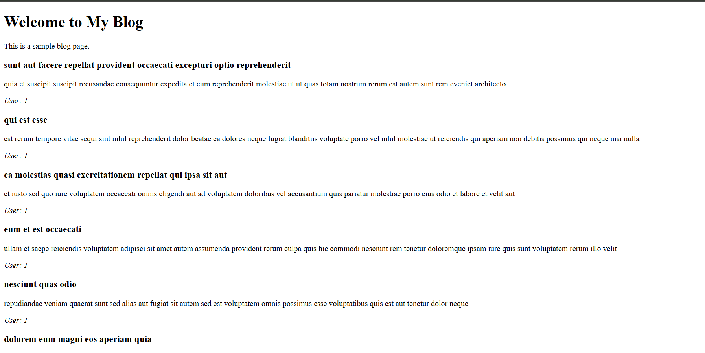

# Лабораторная работа №4

## Облачное хранилище данных. Amazon S3

### Описание лабораторной работы

В данной лабораторной работе изучается **Amazon S3 (Simple Storage Service)** - сервис объектного хранения данных, предоставляемый AWS.
В процессе выполнения студент создаёт публичный и приватный бакеты, загружает и управляет объектами через консоль и CLI, включает версионирование, настраивает Lifecycle-правила и Static Website Hosting.
Дополнительно реализуется загрузка файлов в S3 через веб-форму с использованием **AWS SDK for PHP**.

## Цель работы

Целью работы является познакомиться с сервисом Amazon S3 (Simple Storage Service) и отработать основные операции:

- создание публичного и приватного бакетов;
- загрузку и организацию объектов;
- работу с S3 через AWS CLI (копирование, перемещение, синхронизация);
- настройку версионирования и шифрования;
- использование S3 Static Website Hosting;
- применение Lifecycle-правил для архивирования старых данных.

## Основные задачи

1. Создать публичный и приватный бакеты в Amazon S3.
2. Загрузить и организовать объекты (через консоль и CLI).
3. Настроить версионирование и Lifecycle-правила.
4. Развернуть статический веб-сайт на базе S3.
5. Реализовать загрузку файлов через AWS SDK (дополнительное задание).

## Практическая часть

### Шаг 1. Подготовка структуры

Создана локальная структура каталогов и файлов:

```
s3-lab/
├── public/
│   ├── avatars/
│   │   ├── user1.jpg
│   │   └── user2.jpg
│   └── content/logo.png
├── private/
│   └── logs/activity.csv
└── README.md
```

Регион работы: **eu-central-1 (Frankfurt)**
Бакеты будут названы:

- Публичный — `cc-lab4-pub-k01-nikita`
- Приватный — `cc-lab4-priv-k01-nikita`

### Шаг 2. Создание бакетов

Через AWS Management Console были созданы:

- **Публичный бакет** — `cc-lab4-pub-k01-nikita`

  - Object Ownership: _ACLs enabled_
  - Block all public access: **отключено**

- **Приватный бакет** — `cc-lab4-priv-k01-nikita`

  - Object Ownership: _ACLs enabled_
  - Block all public access: **включено**

**Ответ на вопрос:**

> “Block all public access” — защита, запрещающая любые публичные права доступа к объектам. Если опцию включить, доступ через интернет будет полностью заблокирован.
> 

### Шаг 3. Загрузка объектов через консоль

Файлы были загружены вручную:

- `avatars/user1.jpg` — в публичный бакет (`public-read`)
- `logs/activity.csv` — в приватный бакет (по умолчанию приватный)
  
  

**Ответ на вопрос:**

> _Object Key_ — это уникальный идентификатор объекта в S3. Он включает "путь" и имя файла. Например:
> `avatars/user1.jpg` — ключ, а `user1.jpg` — имя файла.

### Шаг 4. Загрузка через AWS CLI

Команды:

```bash
aws s3 cp s3-lab/public/avatars/user2.jpg s3://cc-lab4-pub-k01/avatars/user2.jpg -acl public-read
aws s3 cp s3-lab/public/content/logo.png s3://cc-lab4-pub-k01/content/logo.png -acl public-read
aws s3 cp s3-lab/private/logs/activity.csv s3://cc-lab4-priv-k01/logs/activity.csv
```


**Ответ на вопрос:**

- `cp` — копирование файлов,
- `mv` — перемещение (с удалением локального оригинала),
- `sync` — синхронизация каталогов.
  Флаг `-acl public-read` делает объект доступным публично.

-

### Шаг 5. Проверка доступа

Проверка URL:

```
https://cc-lab4-pub-k01.s3.eu-central-1.amazonaws.com/avatars/user1.jpg
```



Доступен (публичный объект)
Приватный объект `activity.csv` — недоступен (403 Forbidden)


-

### Шаг 6. Версионирование объектов

Через **Properties → Bucket Versioning → Enable** включено версионирование для обоих бакетов.
После повторной загрузки `logo.png` создана новая версия.


**Ответ на вопрос:**

> При выключении версионирования существующие версии сохраняются, но новые версии больше не создаются.

### Шаг 7. Lifecycle-правила

В приватном бакете создано правило:

- Имя: `logs-archive`
- Префикс: `logs/`
- Transition → Standard-IA через **30 дней**
- Transition → Glacier Deep Archive через **365 дней**
- Expiration → удалить через **5 лет (1825 дней)**
  

**Ответ на вопрос:**

> _Storage Class_ — это уровень хранения данных в S3, определяющий стоимость и скорость доступа (Standard, IA, Glacier и др.).
> Используется для оптимизации расходов и архивации старых данных.

-

### Шаг 8. Статический веб-сайт

Создан бакет:

```
cc-lab4-web-k01-nikita
```

Параметры:

- Object Ownership: ACLs enabled
- Block all public access: **off**
- Static website hosting: **enabled**
- Index document: `index.html`

Загружены файлы:

```
index.html
index.js
styles.css
```

Сайт доступен по адресу:

```
http://cc-lab4-web-k01.s3-website.eu-central-1.amazonaws.com
```

Результат:


### Шаг 9. Дополнительное задание — загрузка файлов через AWS SDK

Создан веб-интерфейс для загрузки файлов на S3 через **PHP + AWS SDK**.

#### index.php

```html
<form action="upload.php" method="post" enctype="multipart/form-data">
  <input type="file" name="fileToUpload" required />
  <input type="submit" value="Upload File" />
</form>
```

#### upload.php (доработанный)

```php
require 'vendor/autoload.php';
use Aws\S3\S3Client;
use Ramsey\Uuid\Uuid;

define('BUCKET_NAME', 'cc-lab4-web-k01');
define('REGION', 'eu-central-1');

$db = new PDO('sqlite:database.sqlite');
$db->exec("CREATE TABLE IF NOT EXISTS uploads (
  id INTEGER PRIMARY KEY AUTOINCREMENT,
  original_name TEXT, new_name TEXT, url TEXT, upload_date TEXT
)");

$s3 = new S3Client(['version'=>'latest', 'region'=>REGION]);

if ($_FILES['fileToUpload']) {
  $file = $_FILES['fileToUpload']['tmp_name'];
  $filename = $_FILES['fileToUpload']['name'];
  $unique = Uuid::uuid4()->toString() . "_" . $filename;
  $key = "avatars/$unique";

  $result = $s3->putObject([
    'Bucket'=>BUCKET_NAME, 'Key'=>$key,
    'SourceFile'=>$file, 'ACL'=>'public-read'
  ]);

  $url = $result['ObjectURL'];
  $stmt = $db->prepare("INSERT INTO uploads (original_name,new_name,url,upload_date)
                        VALUES (?,?,?,datetime('now'))");
  $stmt->execute([$filename,$unique,$url]);

  echo " Файл загружен: <a href='$url'>$url</a>";
}
```

#### list.php

```php
$db = new PDO('sqlite:database.sqlite');
$files = $db->query("SELECT * FROM uploads ORDER BY upload_date DESC")->fetchAll();
foreach ($files as $f) {
  echo "<b>{$f['original_name']}</b> — <a href='{$f['url']}'>Ссылка</a><br>";
}
```

Функциональность:

- Генерация уникального имени (UUID)
- Сохранение метаданных в SQLite
- Вывод истории загруженных файлов

## Использованные источники

1. https://aws.amazon.com/ru/s3/
2. https://docs.aws.amazon.com/AmazonS3/latest/userguide/Welcome.html
3. https://docs.aws.amazon.com/AmazonS3/latest/userguide/example-bucket-policies.html

## Вывод

В ходе лабораторной работы были изучены принципы объектного хранения данных в **Amazon S3**.
Созданы публичный и приватный бакеты, настроено версионирование и Lifecycle-правила, реализован статический сайт и веб-интерфейс для загрузки файлов через AWS SDK.
