# Лабораторная работа №5. Облачные базы данных. Amazon RDS, DynamoDB

## Цель работы

Целью работы является ознакомиться с сервисами Amazon RDS (Relational Database Service) и Amazon DynamoDB, а также научиться:

- Создавать и настраивать экземпляры реляционных баз данных в облаке AWS с использованием Amazon RDS.
- Понимать концепцию Read Replicas и применять их для повышения производительности и отказоустойчивости баз данных.
- Подключаться к базе данных Amazon RDS с виртуальной машины EC2 и выполнять базовые операции с данными (создание, чтение, обновление, удаление записей - CRUD).
- (_Дополнительно_) Ознакомиться с сервисом Amazon DynamoDB и освоить работу с хранением данных в NoSQL-формате.

## Условие

> Для студентов специализации DevOps. Для получения высшей оценки рекомендуется дополнительно автоматизировать процесс _создания Security Groups_ и _виртуальной машины EC2_ с помощью инструмента _Terraform_.

### Практическая часть

### Шаг 1. Создание VPC, подсетей и Security Groups

### Создание VPC

Был создан VPC `project-vpc` с CIDR `10.0.0.0/16`, содержащий:

- 2 публичные подсети
- 2 приватные подсети

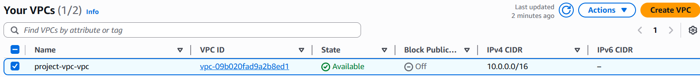
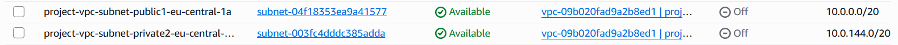

### Создание Security Group для веб-сервера: `web-security-group`

Разрешённый трафик:

| Тип  | Порт | Источник            |
| ---- | ---- | ------------------- |
| HTTP | 80   | 0.0.0.0/0           |
| SSH  | 22   | 0.0.0.0/0 или My IP |

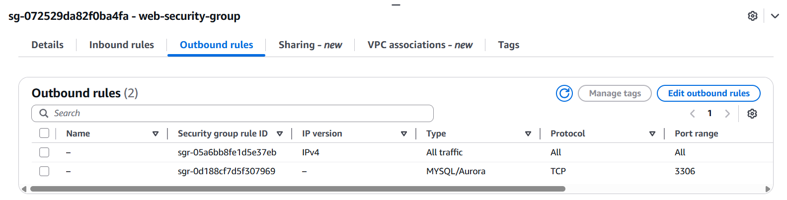

### Создание Security Group для базы данных: `db-mysql-security-group`

| Тип          | Порт | Источник           |
| ------------ | ---- | ------------------ |
| MySQL/Aurora | 3306 | web-security-group |

Также в web-security-group добавлен исходящий трафик → 3306 → db-mysql-security-group.

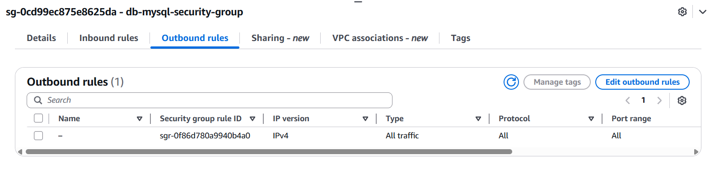

### Шаг 2. Развёртывание Amazon RDS

### Создание Subnet Group

Название: **project-rds-subnet-group**
Она включает 2 приватные подсети в разных Availability Zones.

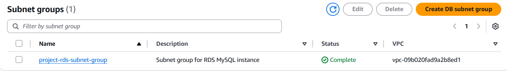

### Что такое Subnet Group? И зачем необходимо создавать Subnet Group для базы данных?

**Subnet Group — это набор приватных подсетей для RDS.
Она нужна, чтобы база могла работать в разных зонах доступности и была защищена (не в публичном интернете).**

### Создание базы данных MySQL

Параметры:

- Engine: **MySQL 8.0**
- DB identifier: **project-rds-mysql-prod**
- Username: **admin**
- Storage: gp3, 20GB, autoscaling 100GB
- Availability: Single AZ
- Public access: NO
- Security group: **db-mysql-security-group**
- Initial DB name: **project_db**

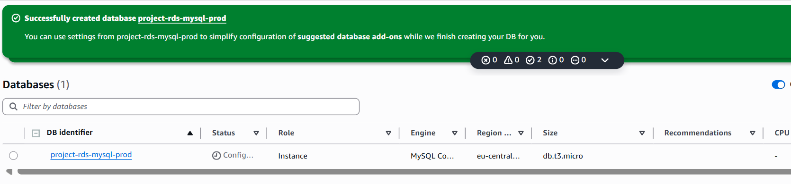

После создания был получен endpoint:

```
project-rds-mysql-prod.<...>.eu-central-1.rds.amazonaws.com
```

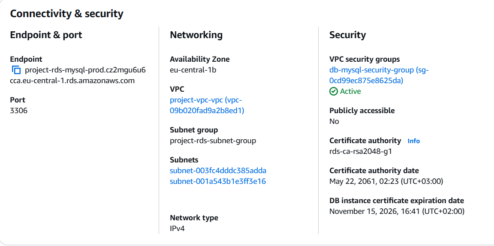

### Шаг 3. Создание EC2 и установка MySQL клиента

Создан EC2-инстанс:

- Amazon Linux 2023
- В публичной подсети
- Security group: `web-security-group`

При запуске добавлен user-data:

```bash
#!/bin/bash
dnf update -y
dnf install -y mariadb105
```

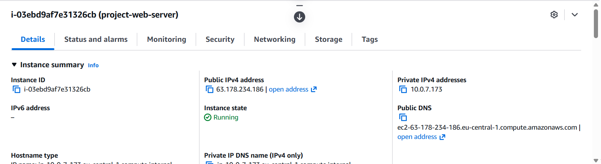

Подключение по SSH:

```
ssh -i project-key.pem ec2-user@<Public-IP>
```

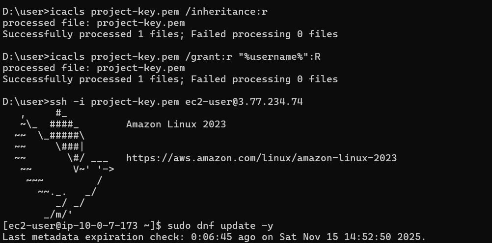

### Шаг 4. Подключение к RDS и CRUD через MySQL CLI

### Подключение

```
mysql -h <RDS_ENDPOINT> -u admin -p
USE project_db;
```

### Создание таблиц

```sql
CREATE TABLE categories (
    id INT AUTO_INCREMENT PRIMARY KEY,
    name VARCHAR(100) NOT NULL
);

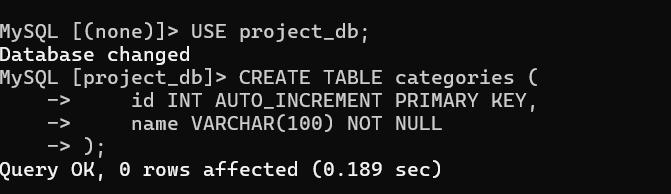

CREATE TABLE todos (
    id INT AUTO_INCREMENT PRIMARY KEY,
    title VARCHAR(255),
    status VARCHAR(50),
    category_id INT,
    FOREIGN KEY (category_id) REFERENCES categories(id)
);
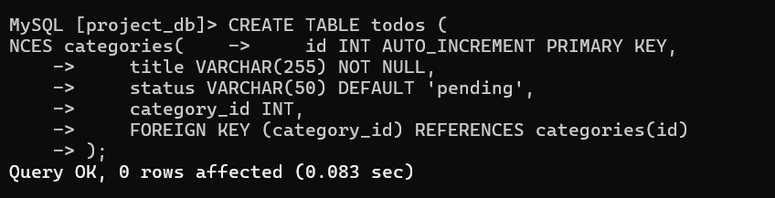
```

### Вставка данных

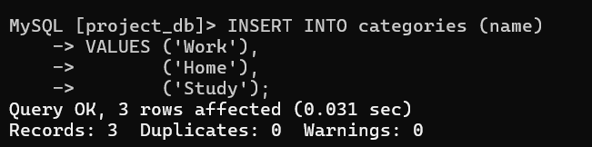
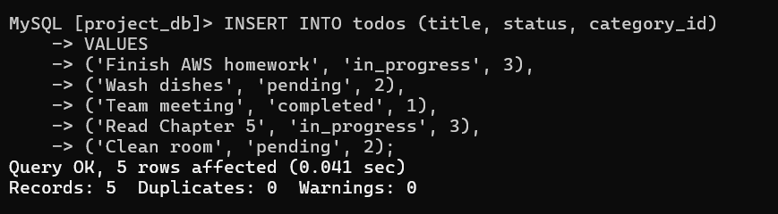

### JOIN-запрос

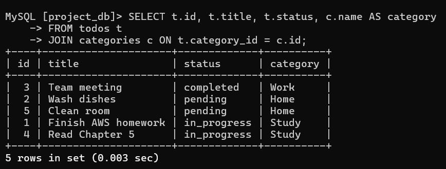

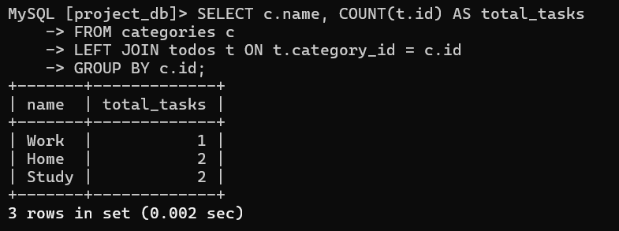

### Шаг 5. Создание Read Replica

Создана реплика:

- Identifier: **project-rds-mysql-read-replica**
- Storage: gp3
- Public access: NO
- Security group: db-mysql-security-group

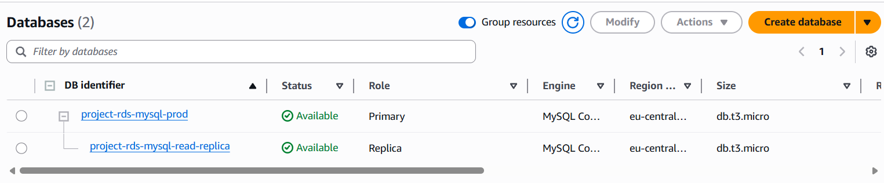

### Подключение к реплике

```
mysql -h <REPLICA_ENDPOINT> -u admin -p
USE project_db;
SELECT * FROM todos;
```

Данные отображаются — _потому что реплика синхронизируется с master_.

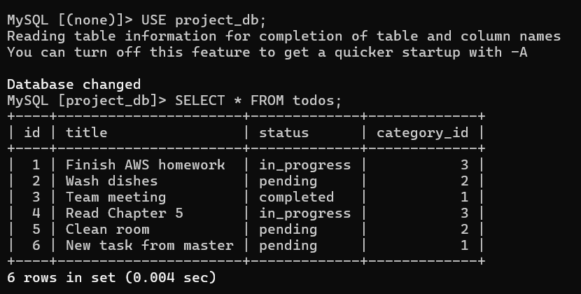

### Попытка записи

```
INSERT INTO categories (name) VALUES ('TestCategory');
```

Ошибка:
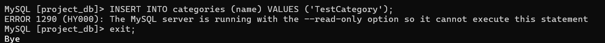

```
ERROR 1290 (HY000): The MySQL server is running with -read-only
```

Read Replica доступна только для чтения — это её назначение.

### Добавление записи на мастер

После добавления записи на master она появилась в реплике.

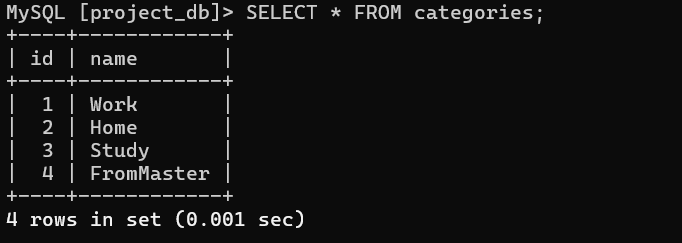

**Вывод:** реплика работает корректно.

### Какие данные вы видите при подключении к Read Replica? Почему?

На read replica отображаются **те же данные**, что и в основном экземпляре базы данных.
Это происходит потому, что реплика автоматически синхронизируется с master посредством механизма асинхронной репликации MySQL.

### Получилось ли выполнить запись (INSERT/UPDATE) на реплике? Почему?

Нет, запись выполнить нельзя.
При попытке записи появляется ошибка:

```
ERROR 1290 (HY000): The MySQL server is running with the --read-only option
```

Это происходит потому, что read replica работает в режиме **только для чтения**, и любые операции записи на неё запрещены.

### Отобразилась ли новая запись на реплике? Почему?

Да, новая запись отображается.
Это происходит потому, что read replica автоматически получает все изменения, которые выполняются на master-инстансе, и обновляет свои данные.

### Зачем нужны Read Replicas и где они используются?

Read Replicas используются для:

- **разгрузки master-экземпляра** (весь трафик чтения направляется на реплику)
- **повышения производительности** приложений
- **масштабирования чтения** при большом количестве пользователей
- **создания резервной копии**, которую можно в любой момент поднять как новый независимый экземпляр

### Типичные сценарии использования:

- высоконагруженные веб-приложения (чтение > запись)
- аналитика и отчёты
- распределение нагрузки между несколькими серверами
- повышение отказоустойчивости

## **Шаг 6a. Развертывание CRUD приложения**

На EC2 установлен:

```
sudo dnf install httpd php php-mysqlnd -y
sudo systemctl enable -now httpd
```

Создана структура:

```
/var/www/html/project/
    index.php      – чтение из реплики
    create.php     – запись в master
    delete.php     – удаление из master
    config-master.php
    config-replica.php
```

### index.php — чтение из реплики

Файл **create.php** использует `config-master.php`, который подключается к **основной базе RDS (master)**.
Это необходимо, потому что только master позволяет выполнять операции:

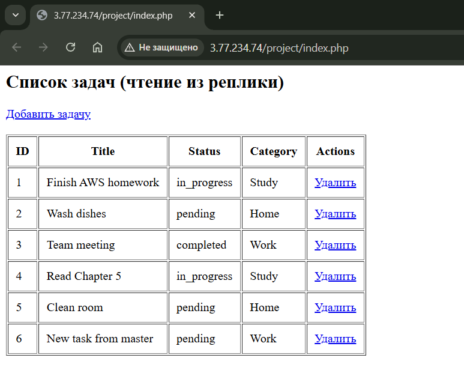

### create.php — добавление задач в master

Файл **create.php** использует `config-master.php`, который подключается к **основной базе RDS (master)**.
Это необходимо, потому что только master позволяет выполнять операции:

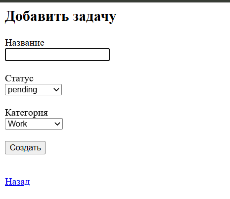

### delete.php — удаление с master

Файл **delete.php** также использует подключение к **master**, потому что операция удаления требует прав записи.

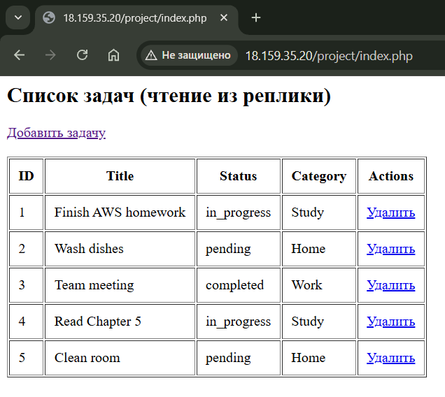

# **Вывод**

В ходе работы была создана инфраструктура для реляционной базы в AWS, развёрнута RDS MySQL, настроена Read Replica, EC2-инстанс, выполнены SQL операции, развернуто PHP CRUD-приложение, использующее master для записи и реплику для чтения. Достигнута цель работы — изучение облачных баз данных и взаимодействия приложений с ними.

### Список источников

- AWS Documentation
  [- Amazon RDS User Guide](https://docs.aws.amazon.com/AmazonRDS/latest/UserGuide/CHAP_GettingStarted.html)
- AWS DynamoDB Guide
  [- PHP Manual](https://www.php.net/manual/en/index.php)
