# Лабораторная работа №6. Балансирование нагрузки в облаке и авто-масштабирование

## Цель работы

Закрепить навыки работы с AWS EC2, Elastic Load Balancer, Auto Scaling и CloudWatch, создав отказоустойчивую и автоматически масштабируемую архитектуру.

Студент развернёт:

- VPC с публичными и приватными подсетями;
- Виртуальную машину с веб-сервером (nginx);
- Application Load Balancer;
- Auto Scaling Group (на основе AMI);
- нагрузочный тест с использованием CloudWatch.

## Условие

### Шаг 1. Создание VPC и подсетей

**Параметры, которые я использовал:**

- **VPC CIDR:** `10.0.0.0/16`
- **Public Subnet 1:** `10.0.1.0/24` (eu-central-1a)
- **Public Subnet 2:** `10.0.2.0/24` (eu-central-1b)
- **Private Subnet 1:** `10.0.128.0/24`
- **Private Subnet 2:** `10.0.144.0/24`
- **Internet Gateway:** создан и прикреплён
- **Route Table для публичных подсетей:**

```
0.0.0.0/0 → Internet Gateway
```

Публичные подсети нужны, чтобы Load Balancer был доступен из интернета. Приватные — для EC2 инстансов Auto Scaling, чтобы они не имели публичного доступа.

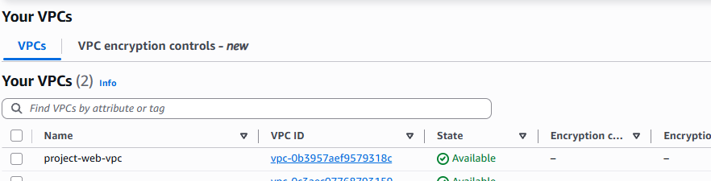
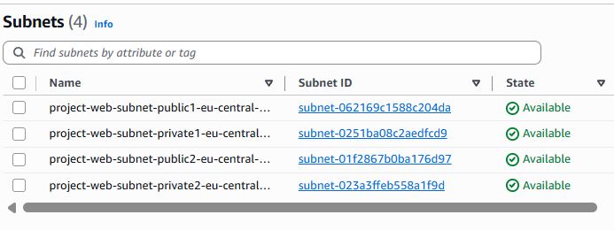
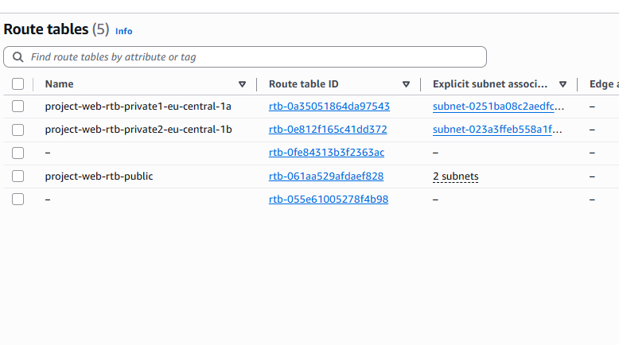

### Шаг 2. Создание и настройка виртуальной машины

**Параметры машины:**

- **AMI:** Amazon Linux 2
- **Instance type:** t3.micro
- **Subnet:** Public
- **Auto-assign Public IP:** Enabled
- **Security Group:**

  - HTTP 80 → 0.0.0.0/0
  - SSH 22 → My IP

- **Monitoring:** Detailed CloudWatch enabled
- **User Data (скрипт):**

```bash
#!/bin/bash
set -e

# Обновление системы
dnf update -y

# Установка Nginx + PHP-FPM
dnf install -y nginx php php-fpm php-cli

# Включаем автозапуск сервисов
systemctl enable nginx
systemctl enable php-fpm

# Создаём директорию под сайт
mkdir -p /var/www/html

cat > /var/www/html/index.php << 'EOF'
<?php
$requestUri = parse_url($_SERVER['REQUEST_URI'], PHP_URL_PATH);

if ($requestUri === '/load') {
    runCpuLoad();
} else {
    showHome();
}

function runCpuLoad(): void
{
    ini_set('max_execution_time', '600');

    $seconds = isset($_GET['seconds']) ? (int)$_GET['seconds'] : 180;
    $seconds = max(30, min($seconds, 600)); // от 30 до 600 сек

    $endTime = microtime(true) + $seconds;

    $seed = random_int(1, 1_000_000);
    $dummy = 0.0;

    while (microtime(true) < $endTime) {
        for ($i = 0; $i < 2_000_000; $i++) {
            $x = $seed + $i;
            $dummy += sqrt($x) * sin($x) * cos($x) + log($x + 1);
        }
        $seed = ($seed * 1103515245 + 12345) & 0x7fffffff;
    }

    header('Content-Type: text/plain; charset=utf-8');
    echo "Heavy CPU load finished\n";
    echo "Duration: {$seconds} seconds\n";
    echo "Dummy value: " . sprintf('%.5f', fmod($dummy, 1000.0)) . "\n";
}

function showHome(): void
{
    header('Content-Type: text/html; charset=utf-8');
    echo "<h1>Hello from " . htmlspecialchars(gethostname()) . "</h1>";
    echo "<p><a href=\"/load\">Load system (/load)</a></p>";
    echo "<p>e.g.: <code>/load?seconds=60</code></p>";
}
EOF

# Настройка nginx
cat > /etc/nginx/conf.d/default.conf << 'EOF'
server {
    listen 80 default_server;
    server_name _;

    root /var/www/html;
    index index.php index.html;

    location / {
        try_files $uri /index.php?$args;
    }

    location ~ \.php$ {
        include fastcgi_params;
        fastcgi_pass unix:/run/php-fpm/www.sock;
        fastcgi_param SCRIPT_FILENAME $document_root$fastcgi_script_name;
    }
}
EOF

# Удаляем дефолтный конфиг (если есть)
rm -f /etc/nginx/conf.d/*.default

# Меняем права
chown -R nginx:nginx /var/www/html

# Проверяем и стартуем всё
nginx -t
systemctl restart php-fpm
systemctl restart nginx
```


### Шаг 3. Создание AMI

Создаю образ:

```
Name: project-web-server-ami
```

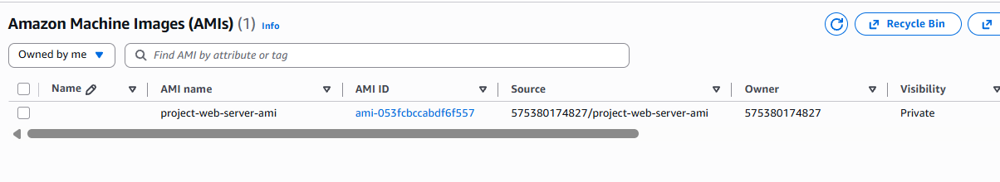

# Контрольный вопрос

### Что такое Image (AMI)?

**AMI — это шаблон виртуальной машины** (ОС + настройки + программы), из которого запускаются новые EC2-инстансы.

### Чем AMI отличается от Snapshot?

- **AMI — полный образ системы** (ОС, конфигурация, диски).
- **Snapshot — снимок одного диска EBS**.

Главное:
_Из AMI можно запускать EC2. Из snapshot — нет._

### Варианты использования AMI

- Запуск новых EC2 с одинаковой конфигурацией
- Auto Scaling Group
- Launch Template
- Резервное копирование / миграция сервера

### Шаг 4. Создание Launch Template

Создаю Launch Template:

- **Name:** project-launch-template
- **AMI:** project-web-server-ami
- **Instance type:** t3.micro
- **Security Group:** тот же, что у EC2
- **Monitoring:** Detailed monitoring enabled

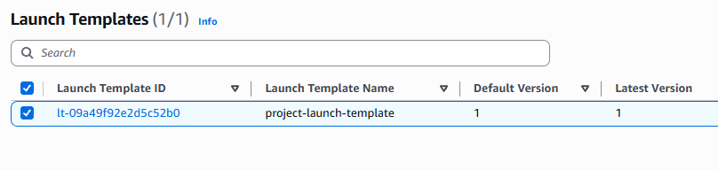

# Контрольный вопроc

### Что такое Launch Template и зачем он нужен? Чем он отличается от Launch Configuration?

**Launch Template — это шаблон для создания EC2-инстансов.**
В нём сохраняются параметры: AMI, тип инстанса, сеть, ключи, SG, UserData и т.д.
Используется Auto Scaling Group и другими сервисами для запуска одинаковых серверов.

### Зачем он нужен?

- чтобы **EC2 создавались автоматически и одинаково**
- чтобы **Auto Scaling Group знала, какие инстансы поднимать**
- чтобы ускорить и стандартизировать развёртывание серверов

### Отличие Launch Template от Launch Configuration

| Launch Template                | Launch Configuration                   |
| ------------------------------ | -------------------------------------- |
| Новый современный формат       | Старый устаревший формат               |
| Позволяет изменять/версировать | Нельзя изменять — только пересоздавать |
| Поддерживает больше параметров | Ограниченный функционал                |
| Рекомендуется AWS              | Уже deprecated                         |

### Шаг 5. Создание Target Group

Создаю Target Group:

- **Name:** project-target-group
- **Target type:** Instances
- **Protocol:** HTTP
- **Port:** 80
- **VPC:** project-vpc

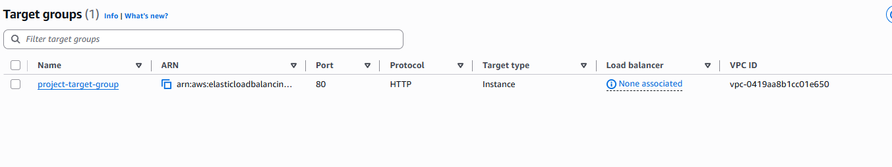

# Контрольный вопрос

### Зачем необходим и какую роль выполняет Target Group?

**Target Group — это список серверов (EC2), на которые Load Balancer отправляет трафик.**

Она выполняет три функции:

**Получает трафик от Load Balancer**
ALB всегда отправляет запросы именно в Target Group, а не напрямую на EC2.

**Проверяет “здоровье” инстансов (health checks)**
Если сервер упал — LB перестаёт ему отправлять трафик.

### Шаг 6. Создание Application Load Balancer

Создаю ALB:

- **Name:** project-alb
- **Scheme:** Internet-facing
- **Subnets:** Public 1 + Public 2
- **Security Group:** web-sg
- **Listener:** HTTP:80 → project-target-group

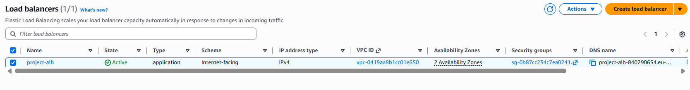
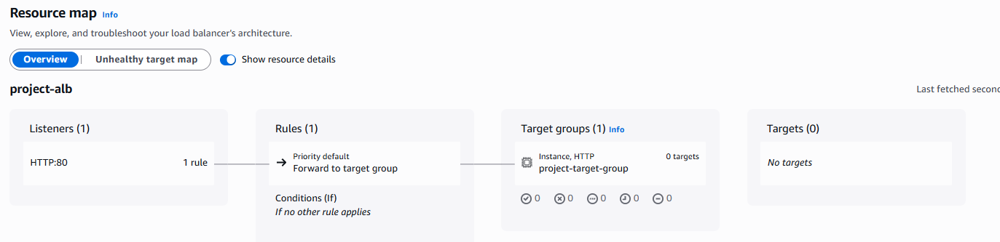

# Контрольные вопросы

### В чем разница между Internet-facing и Internal?

**Internet-facing:**

- Имеет публичный IP
- Доступен из интернета
- Можно открыть через браузер с любого устройства
- Используется для публичных сайтов и API

**Internal:**

- Не имеет публичного IP
- Доступен только внутри VPC
- Используется для внутренних микросервисов, backend-систем, корпоративных сетей

### Что такое Default action и какие есть типы Default action?

**Default Action — это действие, которое Load Balancer выполняет по умолчанию, если запрос не подходит ни под одно правило.**

### **Типы Default Action в ALB**

1. **Forward** — отправить трафик в Target Group
2. **Redirect** — перенаправить пользователя (например, с HTTP → HTTPS)
3. **Fixed response** — вернуть статичный ответ (код 200/403/404 + сообщение)

### Шаг 7. Создание Auto Scaling Group

Параметры:

- **Name:** project-auto-scaling-group
- **Launch template:** project-launch-template
- **Subnets:** Private 1 + Private 2
- **Desired capacity:** 2
- **Min:** 2
- **Max:** 4
- **Scaling policy:**

  - Target tracking
  - Average CPU = 50%
  - Instance warm-up = 60 sec

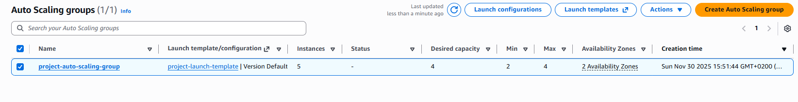

# Контрольные вопросы

### Почему Auto Scaling Group размещается в приватных подсетях?

**Потому что серверы Auto Scaling не должны быть доступны напрямую из интернета.**

Приватные подсети обеспечивают:

1. **Безопасность** — EC2 нельзя атаковать извне.
2. **Правильную архитектуру** — весь внешний трафик должен идти только через Load Balancer.
3. **Контроль доступа** — связь EC2 происходит через ALB, NAT или внутренние сервисы.

### Зачем нужна настройка: `Availability Zone distribution`?

### Зачем нужна настройка “Availability Zone distribution”?

Эта настройка определяет, **как Auto Scaling Group распределяет EC2-инстансы по зонам доступности (AZ)**.

Она используется для:

1. **Повышения отказоустойчивости**
   Если одна зона (например, eu-central-1a) упадёт — в другой (eu-central-1b) всё продолжит работать.

2. **Балансировки нагрузки между зонами**
   Сервера не создаются все в одной зоне, нагрузка распределяется равномерно.

### Что такое _Instance warm-up period_ и зачем он нужен?

**Instance warm-up period — это время, которое отдаётся новому EC2-инстансу, чтобы он полностью загрузился, прежде чем его метрики начнёт учитывать Auto Scaling.**

### Зачем он нужен?

- Чтобы **новый сервер успел запуститься**, применить User Data, поднять nginx и ПО.
- Чтобы Auto Scaling **не считал его “недогруженным”** и не запускал лишние инстансы.
- Чтобы **правильно рассчитывать среднюю CPU нагрузку** всей группы.

### Шаг 8. Тестирование Application Load Balancer

Открываю в браузере:

```
http://project-alb-XXXX.eu-central-1.elb.amazonaws.com
```

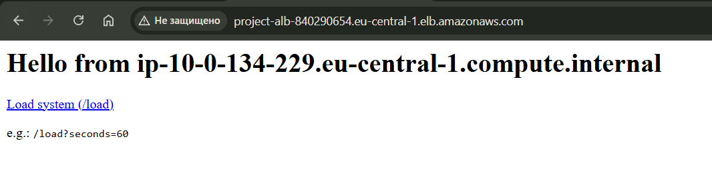
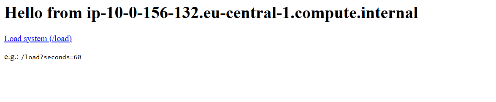
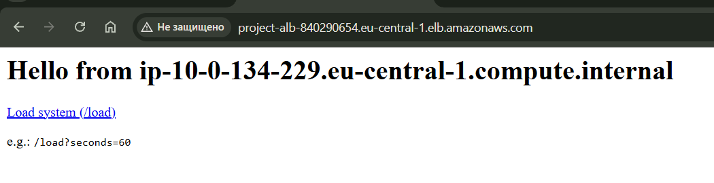

# Контрольный вопрос

**Почему IP-адреса разные?**
Потому что балансировщик отправляет запросы на разные EC2.

### Шаг 9. Тестирование Auto Scaling

Открываю 6–7 вкладок:

```
http://project-alb-840290654.eu-central-1.elb.amazonaws.com/load?seconds=60
```

Через 1–2 минуты:

- CPU растёт выше 50%
- Alarm становится красным
- Auto Scaling Group запускает новые EC2

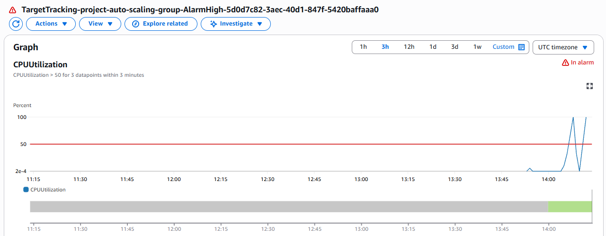
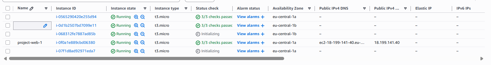

# Контрольный вопрос

**Роль Auto Scaling:**
Повышает/уменьшает количество EC2, чтобы поддерживать нужный уровень нагрузки.

# **Шаг 10. Очистка ресурсов**

Удаляю в строгой последовательности:

1. Load Balancer
2. Target Group
3. Auto Scaling Group
4. EC2 Instances
5. AMI + Snapshots
6. Launch Template
7. Subnets
8. Route Tables
9. Internet Gateway
10. VPC

# **Вывод**

В ходе лабораторной работы я:

- Создал VPC с подсетями
- Развернул веб-сервер
- Настроил AMI, Launch Template, Target Group
- Развернул Load Balancer
- Создал Auto Scaling Group
- Провёл нагрузочный тест
- Наблюдал автоматическое масштабирование
- Очистил инфраструктуру

Получил практический опыт построения отказоустойчивой и масштабируемой архитектуры в AWS.

### Список использованных источников

1. **Amazon VPC — Overview**
   [https://docs.aws.amazon.com/vpc/latest/userguide/what-is-amazon-vpc.html](https://docs.aws.amazon.com/vpc/latest/userguide/what-is-amazon-vpc.html)

2. **Amazon EC2 — Concepts**
   [https://docs.aws.amazon.com/AWSEC2/latest/UserGuide/concepts.html](https://docs.aws.amazon.com/AWSEC2/latest/UserGuide/concepts.html)

3. **Amazon EC2 — Amazon Machine Images (AMI)**
   [https://docs.aws.amazon.com/AWSEC2/latest/UserGuide/AMIs.html](https://docs.aws.amazon.com/AWSEC2/latest/UserGuide/AMIs.html)

4. **Amazon CloudWatch — Creating Alarms**
   [https://docs.aws.amazon.com/AmazonCloudWatch/latest/monitoring/AlarmThatSendsEmail.html](https://docs.aws.amazon.com/AmazonCloudWatch/latest/monitoring/AlarmThatSendsEmail.html)
